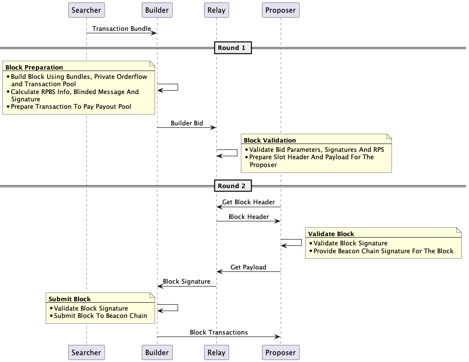

# Welcome To Proof Of Neutrality Relay

The Proof of Neutrality Relay (PoN) is a decentralized, permissionless, and neutral middleware run by validators to participate in the market for block-building and exchange. The PoN relay was built by Blockswap Labs as a solution implementing in protocol Proposer-Builder Separation theory (PBS).

[](https://docs.pon.network/pon/relay)
[](https://docs.pon.network/)

## Why build the Proof of Neutrality Relay?

Ethereum’s credible neutrality and decentralization of consensus is under threat from centralized relays and censorship caused by MEV. The PoN relay’s decentralized infrastructure is necessary to prevent a world of permissioned communication between block-builders and block proposers.

Validators and MEV will become more closely linked in a Proof-of-Stake (PoS) environment due to the appeal of higher MEV staking rewards and their growing importance as staking participation increases and rewards will inevitably decrease. The PoN relay maximizes validator staking rewards through the selling of blockspace to an open market, allowing for consistent MEV payouts from the PBS Smoothing Pool.

## How does the Proof of Neutrality Relay Work?

In the Ethereum Proof-of-Stake (PoS) system, node operators use three essential pieces of software components: the validator client, the execution client, and the consensus client. The PoN relay is an additional open-source software that seamlessly integrates with the consensus client, allowing for connection to a network of block-builders and the outsourcing of block-building. Additionally, it uses zero-knowledge proofs and encrypted communication to facilitate the builder’s request for a validator, ensuring guaranteed validator payment inclusion in a block while also keeping block content unrevealed.

Block-builders create full blocks aiming for the optimal MEV extraction and equitable distribution of rewards. Once they are done, the blocks are sent to relays. The PoN relay selects the most profitable block received from various builders, submits it to the block proposer, and the consensus client then sends it to the Ethereum network for verification and block inclusion.

Reporters are a novel addition and essential for a decentralized infrastructure to run smoothly. In the PoN relay, reporters monitor the actions of builders and proposers to ensure that there is no malicious behavior or wrongdoing. If a violation occurs, the reporter can submit a report and earn ETH for securing the protocol.

## Goals Of PON Relay
* **Bid Neutrality**- PoN Network and in hinsight, PoN relay at no point has access to the block transactions being built by the relay. This way the builder is alyways secure from the relay. There are rules and monitoring stack governed by the Restrictive Partially Blind Scheme which ensure no party including the PoN relay is ever cheated by any other PoN component.
* **Performance**- PoN Relay uses post epoch validation which makes the need for relay level block simulation redundant. By removing block validation, the performance is increased much more which translates into more MEV available monteraly for the builders.
* **Transparency**- PoN Relay implements out of the box data APIs while also allowing for easy setup of external services like Metabase for data transparency. Anyone can run reporter with PoN relay and maintain transparency of the bids being submitted to PoN Relay and ones being proposed.
* **Support For Extensive Block Building**- PoN Relay uses bulletin board (A MQTT Bases Pub Sub) and its two bids Auction to help the builders build best blocks. Bulletin Board provides a low resource intensive solution for the builders to get updated bids from and based on the updating auction scenerio builders can update the bids.

## Architecture
While PoN maintains the Proposer Builder Separation, currently widely being used in MEV supply chain, it also does some changes which help in achieving neutrality at the relay level.




### Easy Install

Install latest release from [pon-bbrelay](https://github.com/pon-pbs/bbRelay/releases)

Install and run using-
```shell
$ go install github.com/pon-pbs/bbrelay
$ bbrelay --help
```

## Setting Up PON Network

PON Consists of Relay, Builder and Reporter, all of which are essential. If you want to run builder or relay please use the following steps-
#### Builder

[](https://github.com/pon-pbs/bbBuilder)

- Visit [Builder Repository](https://github.com/pon-pbs/bbBuilder)
- Build following the instructions provided

#### Reporter

- Visit [Reporter Repository](https://github.com/pon-pbs/pon-reporter)

    ```Note - The reporter is under development so always use the latest version of reporter```

## Building Relay

### Building From Binaries

Automated builds are available for stable releases and the unstable master branch. Binary
archives are published at https://github.com/pon-pbs/bbRelay.

Use the binaries along with the [](https://docs.pon.network/) to install and run relay from binaries

### Building From Docker

[](https://hub.docker.com/r/blockswap/pon-relay)

To run relay using docker-

```shell
docker pull blockswap/pon-relay
docker run --network=host blockswap/pon-relay relay
```
While running using docker, use command line arguments same as other ways


### Building From Source

To run from source use the main branch of this repository and use the following command-

```shell
go migrate
go run . relay \
--relay-url <Relay_URL> \
--beacon-uris <Beacon_URIS> \
--redis-uri <Redis_URIS> \
--db <DB_URL> \
--secret-key <Relay_BLS> \
--network <Network> \
--max-db-connections <Max_DB_Connections> \
--max-idle-connections <Max_Idle_Connections> \
--max-idle-timeout <Max_Idle_Timeout> \
--db-driver <DB_Driver> \
--pon-pool <PON_POOL_URL> \
--pon-pool-API-Key <PON_POOL_API_KEY> \
--bulletinBoard-broker <Bulletin_Board_Broker> \
--bulletinBoard-port <Bulletin_Board_Port> \
--bulletinBoard-client <Bulletin_Board_Client> \
--bulletinBoard-password <Bulletin_Board_Password> \
--reporter-url <Reporter_URL> \
--bid-timeout <Bid_Timeout> \
--relay-read-timeout <Relay_Read_Timeout> \
--relay-read-header-timeout <Relay_Read_Header_Timeout>
--relay-write-timeout <Relay_Write_Timeout> \
--relay-idle-timeout <Relay_Idle_Timeout> \
--new-relic-application <New_Relic_Application> \
--new-relic-license <New_Relic_License> \
--new-relic-forwarding <New_Relic_Forwarding>
```
#### Relay Services


If You Want To Run A Postgres Server And Redis Use The Provided Docker Compose File By Following The [Docker Documentation](./docker-compose/Readme.md)
``` If you use your own POSTGRES_DB_USER and POSTGRES_DB_PASSWORD, please update parameter when running relay based on that```

#### Metabase


PON Relay comes with a metabase docker-compose file. It can be used by following the [Docker Documentation](./docker-compose/Readme.md).
``` For Performance Its Better If You Run The Service In Different Machine Then The Relay```

#### PoN Builder Parameters

| Parameter | Description | Default | Required |
| --- | --- | --- | --- |
| `--relay-url` | Listen Address For The PoN Relay Service Locally| `"localhost:9000"` | No |
| `--beacon-uris` | Beacon Node Endpoint | `""` | Yes |
| `--db` | Database URL | `""` | Yes |
| `--secret-key` | BLS Secret Key Of Relay | `""` | Yes |
| `--network` | Network `(Testnet/ Mainnet)` | `"Testnet"` | No |
| `--max-db-connections` | Maximum Database Connections | `100` | No |
| `--max-idle-connections` | Maximum Database Idle Connections | `100` | No |
| `--max-idle-timeout` | Maximum Database Timeout `(In 1s/ 5h format)`  | `100s` | No |
| `--db-driver` | Database Driver | `postgres` | No |
| `--pon-pool` | Pon Pool Subgraph URL | `""` | Yes |
| `--bulletinBoard-broker` | Bulletin Board MQTT Broker URL | `""` | Yes |
| `--bulletinBoard-port` | Bulletin Board MQTT Port | `""` | Yes |
| `--bulletinBoard-client` | Bulletin Board Client | `""` | Yes |̦
| `--bulletinBoard-password` | Bulletin Board Password | `""` | Yes |
| `--bid-timeout` | Maximum Time Bid Is Kept With Relay `(In 1s/ 5h format)` | `"15s"` | No |
| `--relay-read-timeout` | Relay Server Read Timeout `(In 1s/ 5h format)` | `"10s"` | No |
| `--relay-read-header-timeout` | Relay Server Read Header Timeout `(In 1s/ 5h format)` | `"10s"` | No |
| `--relay-write-timeout` | Relay Server Write Timeout `(In 1s/ 5h format)` | `"10s"` | No |
| `--relay-idle-timeout` | Relay Idle Timeout `(In 1s/ 5h format)` | `"10s"` | No |
| `--new-relic-application` | New Relic Application `(New Relic Not Used If Application Not Provided)` | `""` | No |
| `--new-relic-license` | New Relic License | `""` | No |
| `--new-relic-forwarding` | New Relic Forwarding | `false` | No |

## Hardware Requirements


## API Spec
[](./docs/swagger.yaml)

API Spec Is Generated Using Go-Swagger for Open API Implementation. You can follow the specification by visiting the [API-Spec](./docs/APISpec.md)
If you want to make changes to the swagger file, run the following commands-

```shell
make swagger
make serve-swagger
```

### Whitelisted Relays

| Relay ECDSA | Relay BLS Public Key | Relay API |
|--|--|--|
| N/A | 0xa44f64faca0209764461b2abfe3533f9f6ed1d51844974e22d79d4cfd06eff858bb434d063e512ce55a1841e66977bfd | proof-relayer.pon-relay.com |

### Getting Your Relay Whitelisted

Make a PR that adds your details to whitelisted relay table and we will approve your relay and add to the payout pool.

# Software is provided with no guarantees
Please note that this relay has not been subjected to a security audit. By using this relay, there is a risk that assets could be compromised. Therefore, you use this relay at your own risk. It is provided as is, as a public good, without any guarantees.


